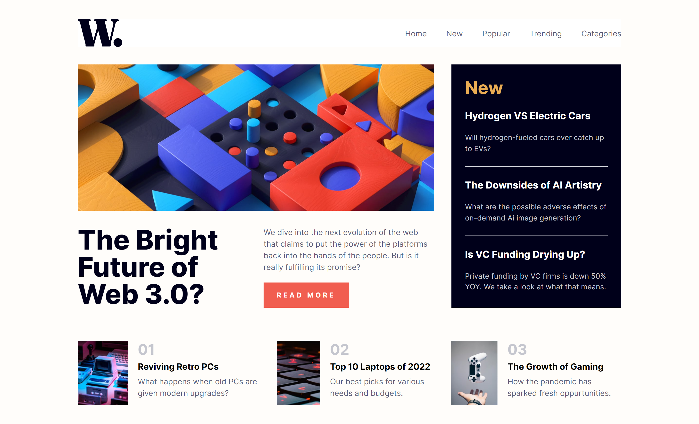

# Hi Everyone!

Finished this junior fem challenge to practice coding using Vue, mobile first approach and fully responsive.

- Check out the link for this project: [https://jcasia-news-homepage.netlify.app/](https://jcasia-news-homepage.netlify.app/)

### I built this project using:

- Vue
- Tailwind CSS

### Here are some screenshots of the project:

